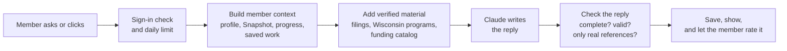

# How the WCCC Member Portal Works

A short overview for WCCC members reviewing this repository: what the portal
does, how it is built, and how its AI features produce an answer.

*Last updated 11 September 2026. Live site: https://wccc-business-network.vercel.app*

---

## What it does

The portal is a technical assistant for WCCC member businesses. After a
four-question sign-up, a member gets:

| Feature | What the member gets |
| --- | --- |
| **Business Snapshot** | Seven questions that set their stage and top priority |
| **Roadmap** | Seven stages (Launch → Legacy) of guided steps, all open to every member |
| **Deadlines** | Wisconsin and federal filings, narrowed to the ones that apply to them |
| **AI Coach** | Short answers that already know their business |
| **Decision Grill** | Hard questions about a decision, then a written brief |
| **Funding & Programs** | Up to five real funding or support matches, with why each fits |
| **Toolkit documents** | Documents built from their own answers, including a one-page WCCC Support Brief |

---

## How it's built

| Layer | Tool | Role |
| --- | --- | --- |
| Web app | [Next.js 16](https://nextjs.org/docs) + React 19, TypeScript, Tailwind CSS 4 | Pages, dashboard, and the API routes |
| Sign-in | [Clerk](https://clerk.com/docs) | Accounts and sessions |
| Database | [Supabase](https://supabase.com/docs) (Postgres) | Member profiles, progress, saved AI output |
| AI | [Anthropic Claude API](https://docs.anthropic.com) | Model set by the `ANTHROPIC_MODEL` environment variable |
| Federal funding data | [Grants.gov Search2 API](https://grants.gov/api/common/search2) | Live federal opportunities, refreshed nightly |
| Hosting | [Vercel](https://vercel.com/docs) | Deploys on every push to `master`; runs the nightly job |
| Tests | [Vitest](https://vitest.dev) | 283 automated tests |

### Where things live

```
app/            Pages and server routes
  api/ai/       One route per AI feature (coach, grill, opportunities, document, ...)
  api/cron/     Nightly Grants.gov refresh
  dashboard/    Member dashboard and roadmap module pages
components/     Interface pieces (AICoach, DecisionGrillPanel, OpportunitiesPanel, ...)
lib/            Logic: AI calls, member context, catalogs, database access
data/           Content: roadmap modules, filings calendar, verified Wisconsin programs
test/           Automated tests for lib/ and data/
supabase-schema.sql   Database tables (safe to re-run)
```

---

## How the AI creates a response

The main AI features (Coach, Decision Grill, Funding & Programs, Toolkit
documents) follow the same path. The model is never simply asked a question on
its own: it is given this member's details and a list of verified facts, and its
reply is checked before anyone sees it. The step review and module summary use a
lighter version, described in the table below.



1. **Sign-in and limits.** Every route that calls the AI requires a signed-in
   member and enforces a per-member daily cap (`lib/aiRateLimit.ts`).
2. **One shared picture of the member.** `lib/memberContext.ts` builds a single
   description used by the main features: business details, Snapshot stage and
   priority, saved facts (marked as self-reported, with old ones flagged), roadmap
   progress, previous briefs and documents, and the opening lines of past
   chats. Only the opening lines are sent, never full transcripts.
3. **Verified material.** `lib/adviceCatalog.ts` adds the facts the model is
   allowed to state: the filings calendar (`data/compliance.ts`) and the
   Wisconsin programs WCCC has checked (`data/wisconsinPrograms.ts`). The model is
   told to name a source or say it doesn't know.
4. **The model call.** `lib/ai.ts` sends the request. The Coach streams its reply
   as it is written; the other features return the whole reply at once.
5. **Checks before anything is shown.** A reply that runs out of room is
   reported as unfinished rather than shown as complete. Structured replies (the
   Decision Grill brief, funding matches) are validated field by field.
   Markdown symbols are removed before display (`lib/plainText.ts`).
6. **Save and rate.** Results are saved to the member's account and reload on
   their next visit. Every answer has Yes/No buttons, and each rating is stored
   along with the model that produced it (`ai_feedback` table).

### Funding & Programs: pick from a list, never from memory

This feature has the strongest safeguard, because a made-up or closed program
costs a member a wasted application.

1. A nightly job searches Grants.gov using a keyword tied to the member's
   industry, keeping only open or upcoming grants a small business can apply for
   (`lib/grantsGov.ts`, `lib/grantsCache.ts`).
2. The member's list is combined with WCCC's verified Wisconsin programs.
   Programs a member's own answers clearly rule out are removed
   (`lib/wisconsinFit.ts`).
3. The model receives a numbered list and returns **only reference numbers** plus
   a sentence on fit. The server looks up every name, link and deadline from the
   list itself (`lib/opportunityCatalog.ts`), so a program that isn't on the list
   can never be shown to a member.

### What each feature is given

| Feature | Route | Given | Returns |
| --- | --- | --- | --- |
| AI Coach | `api/ai/coach` | Member context + verified material + the chat | Reply under 120 words, streamed |
| Decision Grill | `api/ai/grill` | Member context + the interview | One question at a time, then a brief (JSON) |
| Step review | `api/ai/review-step` | Business name, industry, city + one step's answers | Strongest point, gap, Wisconsin tip |
| Module summary | `api/ai/summarize-module` | Business details + a module's answers | Saved 150–250 word summary |
| Toolkit documents | `api/ai/document` | A module's answers + the document's instructions in `data/modules.ts` | A saved document |
| Funding & Programs | `api/ai/opportunities` | Member context + numbered catalog | Reference numbers + fit, checked by the server |
| Save from chat | `api/ai/extract-facts` | A Coach conversation | Suggested profile facts, saved only if the member confirms each one |

---

## Principles behind the design

- **Don't state what nobody has verified.** Wisconsin programs are shown only
  after someone at WCCC checks them, and they drop off automatically 180 days
  later until re-checked (next due 25 February 2027).
- **Never invent WCCC programs, events or perks.** The prompts forbid it, and a
  test checks the Support Brief's instructions.
- **The member stays in control.** Profile details are editable, past chats can
  be deleted, and the AI cannot save anything to a profile without the member
  confirming it.
- **Switched off until reviewed.** Answers in Chinese, Spanish and Hmong are
  built but off (`BILINGUAL_ENABLED` in `data/facts.ts`) until a fluent reader
  approves the output.

---

## Known limitations

- Tests cover `lib/` and `data/`, not the API routes or the interface, and they
  use stand-ins for the AI. Problems with real replies (for example, a reply cut
  off by its length limit) have only been caught by people using the live site.
- The step review and module summary don't use the shared member context or the
  verified reference list. The step review's prompt still suggests naming "a WCCC
  program", which conflicts with the rule above and should be removed.
- Federal grants rarely appear in Funding & Programs for early-stage members:
  most don't fit, and the model has much less detail about them than about the
  Wisconsin programs.
- The Deadlines panel doesn't yet check business structure, so sole proprietors
  are shown a Wisconsin annual report they don't file.
- Homepage statistics (`data/stats.ts`) haven't been checked against real WCCC
  numbers.
- There is no WCCC staff view, and no email delivery for the Support Brief yet.
- The Supabase project is shared with the sibling `wccc-platform` site; its
  `contacts`, `public_registrations` and `subscribers` tables belong to that
  site.

---

## Where to look next

**In this repository**

| File | Read it for |
| --- | --- |
| `ROADMAP.md` | The full history of AI decisions and what's planned next |
| `NEXT-SESSION-PROMPT.md` | Current state of the work and open issues |
| `WEEK-REVIEW.md` | Plain-language summary of recent changes |
| `DEMO-SCRIPT.md`, `DEMO-QUESTIONS.md` | How to demo the portal, and questions that show it well |
| `WISCONSIN-PROGRAMS-REVIEW.md` | How Wisconsin programs are verified, and the re-check date |
| `VERIFY-DEPLOY.md` | Checks to run on the live site after a deploy |
| `DIRECTORY-DESIGN.md` | A shelved member-directory design and why it was shelved |
| `supabase-schema.sql` | Every database table |
| `lib/memberContext.ts`, `lib/opportunityCatalog.ts`, `lib/ai.ts` | The core of how answers are produced |

Source files explain *why* as well as *what*. Several things that look like bugs
are deliberate and explained in comments, so read the comment before changing
the code.

**Outside documentation**

- Next.js: https://nextjs.org/docs. This project uses Next.js 16, which differs
  from older tutorials; the matching guide ships in `node_modules/next/dist/docs/`.
- Claude API: https://docs.anthropic.com. See prompt caching and streaming in
  particular.
- Supabase: https://supabase.com/docs (row level security)
- Clerk: https://clerk.com/docs (Next.js integration)
- Grants.gov Search2 API: https://grants.gov/api/common/search2

---

## Running it locally

```bash
npm install
npm run dev      # http://localhost:3000
npm test         # automated tests
npm run lint
npm run build
```

Environment variables needed (never commit these): `ANTHROPIC_API_KEY`,
`ANTHROPIC_MODEL` (optional), `NEXT_PUBLIC_CLERK_PUBLISHABLE_KEY`,
`CLERK_SECRET_KEY`, `NEXT_PUBLIC_SUPABASE_URL`, `SUPABASE_SERVICE_ROLE_KEY`, and
`CRON_SECRET` for the nightly job. To set up the database, run
`supabase-schema.sql` and then `supabase-verify.sql` in the Supabase SQL editor
(see `README.md`).
